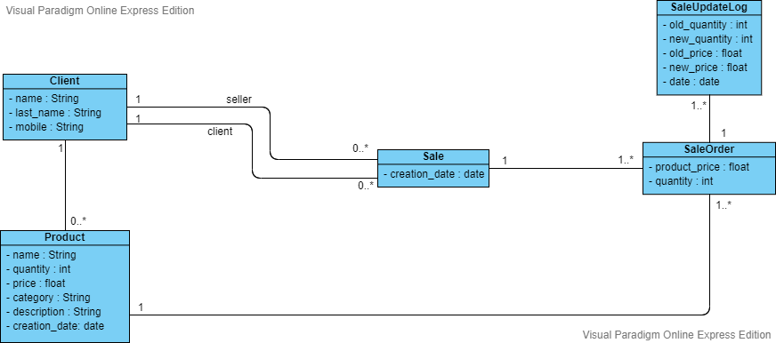

# SalesService
This is the main Sales service repo.\
Please follow the instructions below in order to successfully run the application.
## Prerequisite:
1. jdk-14.0.2
2. gradle 6.6

## Instructions:
1. Clone the following repository (https://github.com/Adam-Oudaimah/SalesRestJava), and CD to it: \
```git clone https://github.com/Adam-Oudaimah/SalesRestJava.git```
2. Init the submodule repository (https://github.com/Adam-Oudaimah/SalesRestSpec) using the folloing command: \
```git submodule update --init --force --remote```
3. Publish A new artifact to Maven local repository using the following command: \
```gradle PublishToMavenLocal```
4. Clone this repository (SalesService), and CD to it.
5. Build the executable .JAR file using the command: \
```gradle bootJar```
5. You need a running MySQL server with an emprty database called 'sales'
6. CD to the following directory from this repository: "build\libs"
7. Run the application using the command: \
```java -jar -Dspring.profiles.active=local SalesService-1.0.0-SNAPSHOT.jar```

This will start the application and you can start using its APIs.

This it the class diagram: \

